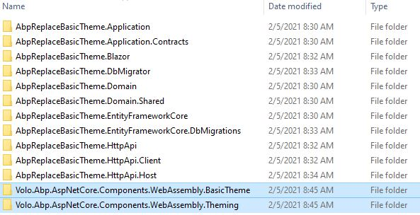
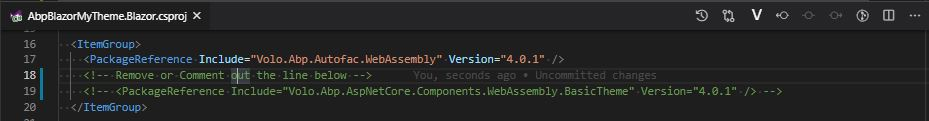
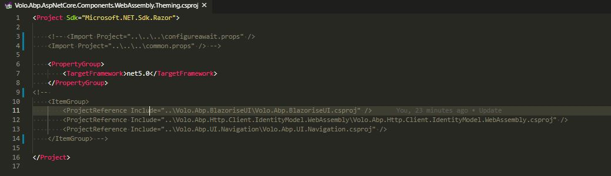
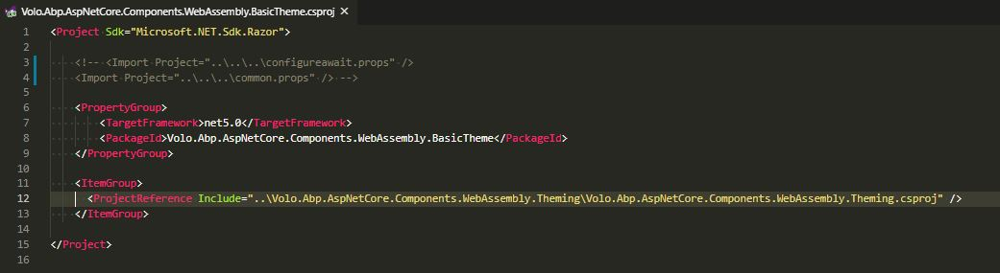
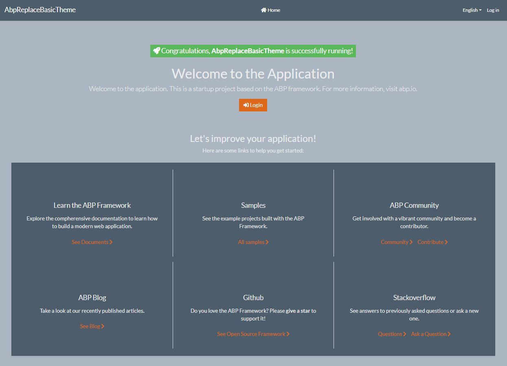

## Replace Basic Bootstrap theme with a free custom Bootstrap theme

## Introduction

In this article, I will show how you can replace the **Basic Bootstrap Theme** with a **free Custom Bootstrap Theme** in a **Blazor ABP Framework** application.

### Source Code

Source code of the completed application is [available on GitHub](https://github.com/bartvanhoey/AbpReplaceCustomTheme.git).

## Requirements

The following tools are needed to be able to run the solution.

* .NET 5.0 SDK
* VsCode, Visual Studio 2019 16.8.0+ or another compatible IDE

## Development

### Creating a new Application

* Install or update the ABP CLI:

```bash
   dotnet tool install -g Volo.Abp.Cli || dotnet tool update -g Volo.Abp.Cli
```

* Use the following ABP CLI command to create a new Blazor ABP application:

```bash
   abp new AbpReplaceCustomTheme -u blazor
```

### Open & Run the Application

* Open the solution in Visual Studio (or your favorite IDE).
* Run the `AbpReplaceCustomTheme.DbMigrator` application to apply the migrations and seed the initial data.
* Run the `AbpReplaceCustomTheme.HttpApi.Host` application to start the server side.
* Run the `AbpReplaceCustomTheme.Blazor` application to start the Blazor UI project.

## Copy BasicTheme to the src folder of your project

* Open a command prompt and clone the [apb repository](https://github.com/abpframework/abp) into your computer.

```bash
   git clone https://github.com/abpframework/abp
```

* Once the cloning is done, navigate to the `framework\src` folder of the repository.
* Copy the `Volo.Abp.AspNetCore.Components.WebAssembly.BasicTheme` project into the `src` folder of your project.
* Copy the `Volo.Abp.AspNetCore.Components.WebAssembly.Theming` project into the `src` folder of your project.



## Remove the Package Reference of the Basic Theme in the Blazor project

* Open the **Blazor.csproj** file and remove or comment out the **BasicTheme** package reference.



## Fix the build errors in WebAssembly.Theming project

* Open file **Volo.Abp.AspNetCore.Components.WebAssembly.Theming.csproj** and remove or comment out the following lines.



* Open a command prompt in the **WebAssembly.Theming** project and run `dotnet build`. The build will fail because of missing nuget packages.

* Run the command below to install the missing nuget packages.

```bash
   abp add-package Volo.Abp.BlazoriseUI
   abp add-package Volo.Abp.Http.Client.IdentityModel.WebAssembly
   abp add-package Volo.Abp.UI.Navigation
```

* Running `dotnet build` again in the **WebAssembly.Theming** project should succeed by now!

## Build the BasicTheme project and fix the build errors

* Open file **Volo.Abp.AspNetCore.Components.WebAssembly.BasicTheme.csproj** and remove or comment out the following lines.



* Open a command prompt in the **WebAssembly.BasicTheme** project and run `dotnet build`. The build should succeed.

## Add a project reference to the BasicTheme project in the Blazor.csproj file

* Open a command prompt in the **Blazor** project of your application and add a project reference to the **BasicTheme** project.

```bash
   dotnet add reference ../../src/Volo.Abp.AspNetCore.Components.WebAssembly.BasicTheme/Volo.Abp.AspNetCore.Components.WebAssembly.BasicTheme.csproj
```

* Run `dotnet build` in the **Blazor** project to see if the project builds successfully!

## Replace Default Bootstrap theme with Custom Bootstrap theme

* Find yourself a a free Bootstrap theme on the internet. In this example I use the  [SuperHero Bootstrap Theme](https://bootswatch.com/superhero/) I found on [bootswatch.com](https://bootswatch.com/).

* Download and replace file **wwwroot\libs\bootstrap\css\bootstrap.min.css** in the **Volo.Abp.AspNetCore.Components.WebAssembly.Theming** project.

## Bundling Blazor project

* Open a command prompt in the **root** of your application to **clean** and **build** your project.

```bash
   dotnet clean
   dotnet build
```

* Open a command prompt in the **Blazor** project enter the command below to bundle the **SuperHero Bootstrap theme**.

```bash
   abp bundle
```

## Start the application by running both the Blazor and HttpApi.Host project

Et voilà! This is the result.



You can now use your custom Bootstrap theme instead of the basic Bootstrap theme.

Find more about adding global styles/scripts and other fundamentals about ABP theming [here](https://docs.abp.io/en/abp/latest/UI/AspNetCore/Theming).

Get the [source code](https://github.com/bartvanhoey/AbpReplaceCustomTheme) on GitHub.

Enjoy and have fun!
